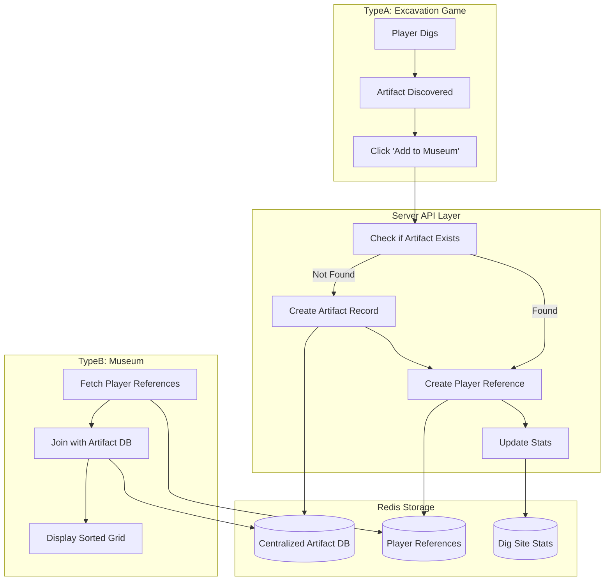

# Design Document

## Overview

The Artifact Persistence & Museum Enhancement feature introduces a two-tier storage architecture: a centralized artifact database that stores unique artifacts once, and a player reference system that links players to their collected artifacts. This design eliminates data duplication, enables rarity tracking through `foundByCount` metrics, and provides rich museum experiences with sorting and filtering capabilities. The system integrates seamlessly with the existing TypeA excavation game and TypeB museum posts.

## Architecture

### High-Level Data Flow



### Storage Architecture

**Centralized Artifact Database**

- Single source of truth for all unique artifacts
- Indexed by artifact ID (derived from Reddit post ID or subreddit name)
- Stores full artifact metadata once
- Tracks global statistics (`foundByCount`, `firstDiscoveredAt`)

**Player Reference System**

- Links players to artifacts they've collected
- Stores player-specific metadata (`collectedAt`, `isBroken`, `sourceDigSite`)
- Enables efficient queries for individual player museums
- Supports sorting and filtering without duplicating artifact data

## Components and Interfaces

### 1. Centralized Artifact Database Schema

**Purpose:** Store unique artifacts once with global metadata

**Redis Key Structure:**

```
artifact:{artifactId}
```

**Data Model:**

```typescript
interface CentralizedArtifact {
  artifactId: string; // Unique ID (e.g., "post_abc123" or "relic_aww")
  type: 'post' | 'subreddit_relic';
  subredditOfOrigin: string; // e.g., "aww", "AskReddit"
  foundByCount: number; // How many players have this artifact
  firstDiscoveredAt: number; // Timestamp of first discovery

  // For type: 'post'
  redditPost?: {
    id: string;
    title: string;
    author: string;
    subreddit: string;
    createdAt: number;
    score: number;
    permalink: string;
    thumbnailUrl?: string;
    textSnippet?: string;
  };

  // For type: 'subreddit_relic'
  subredditRelic?: {
    subredditName: string;
    iconUrl?: string;
    primaryColor: string;
    description: string;
  };
}
```

**Artifact ID Generation:**

```typescript
function generateArtifactId(artifact: ArtifactData): string {
  if (artifact.type === 'post') {
    return `post_${artifact.redditData.id}`;
  } else {
    return `relic_${artifact.relicData.subredditName}`;
  }
}
```

**Redis Operations:**

```typescript
// Store artifact
await redis.set(`artifact:${artifactId}`, JSON.stringify(artifact));

// Retrieve artifact
const data = await redis.get(`artifact:${artifactId}`);
const artifact = data ? JSON.parse(data) : null;

// Increment foundByCount atomically
await redis.hincrby(`artifact:${artifactId}`, 'foundByCount', 1);
```

### 2. Player Reference System

**Purpose:** Link players to their collected artifacts with player-specific metadata

**Redis Key Structure:**

```
player:{userId}:artifacts
```

**Data Model:**

```typescript
interface PlayerArtifactReference {
  artifactId: string; // Reference to centralized artifact
  userId: string;
  collectedAt: number; // Timestamp when player found it
  isBroken: boolean; // Did player break this artifact?
  sourceDigSite: string; // Post ID where artifact was found
}

interface PlayerArtifactCollection {
  userId: string;
  artifacts: PlayerArtifactReference[];
}
```

**Redis Operations:**

```typescript
// Add artifact reference to player's collection
const key = `player:${userId}:artifacts`;
const collection = await redis.get(key);
const data: PlayerArtifactCollection = collection
  ? JSON.parse(collection)
  : { userId, artifacts: [] };

data.artifacts.push(newReference);
await redis.set(key, JSON.stringify(data));

// Retrieve player's collection
const collection = await redis.get(`player:${userId}:artifacts`);
return collection ? JSON.parse(collection) : { userId, artifacts: [] };
```

### 3. Artifact Discovery Service

**Purpose:** Handle artifact discovery flow from excavation game

**Location:** `src/server/core/artifact-discovery.ts`

**Key Functions:**

```typescript
/**
 * Process artifact discovery and save to museum
 */
async function saveDiscoveredArtifact(
  userId: string,
  artifactData: ArtifactData,
  sourceDigSite: string,
  isBroken: boolean
): Promise<SaveArtifactResponse> {
  // 1. Generate artifact ID
  const artifactId = generateArtifactId(artifactData);

  // 2. Check if artifact exists in centralized DB
  let artifact = await getArtifactById(artifactId);

  // 3. If not exists, create new artifact record
  if (!artifact) {
    artifact = await createCentralizedArtifact(artifactId, artifactData);
  }

  // 4. Increment foundByCount
  await incrementFoundByCount(artifactId);

  // 5. Create player reference
  const reference: PlayerArtifactReference = {
    artifactId,
    userId,
    collectedAt: Date.now(),
    isBroken,
    sourceDigSite,
  };
  await addPlayerReference(userId, reference);

  // 6. Update stats
  await updateDigSiteStats(sourceDigSite, isBroken ? 'broken' : 'found');
  await updatePlayerStats(userId, isBroken ? 'broken' : 'found');

  return {
    success: true,
    artifactId,
    foundByCount: artifact.foundByCount + 1,
  };
}

/**
 * Create new artifact in centralized database
 */
async function createCentralizedArtifact(
  artifactId: string,
  artifactData: ArtifactData
): Promise<CentralizedArtifact> {
  const artifact: CentralizedArtifact = {
    artifactId,
    type: artifactData.type,
    subredditOfOrigin:
      artifactData.type === 'post'
        ? artifactData.redditData.subreddit
        : artifactData.relicData.subredditName,
    foundByCount: 0,
    firstDiscoveredAt: Date.now(),
  };

  if (artifactData.type === 'post') {
    artifact.redditPost = artifactData.redditData;
  } else {
    artifact.subredditRelic = artifactData.relicData;
  }

  await redis.set(`artifact:${artifactId}`, JSON.stringify(artifact));
  return artifact;
}

/**
 * Increment foundByCount atomically
 */
async function incrementFoundByCount(artifactId: string): Promise<number> {
  const artifact = await getArtifactById(artifactId);
  if (!artifact) throw new Error('Artifact not found');

  artifact.foundByCount++;
  await redis.set(`artifact:${artifactId}`, JSON.stringify(artifact));
  return artifact.foundByCount;
}
```

### 4. Museum Data Service

**Purpose:** Fetch and format player's museum collection with full artifact details

**Location:** `src/server/core/museum-data.ts`

**Key Functions:**

```typescript
/**
 * Get player's full museum collection with artifact details
 */
async function getPlayerMuseum(userId: string): Promise<MuseumData> {
  // 1. Fetch player's artifact references
  const collection = await getPlayerCollection(userId);

  // 2. Fetch full artifact details for each reference
  const artifactsWithDetails = await Promise.all(
    collection.artifacts.map(async (ref) => {
      const artifact = await getArtifactById(ref.artifactId);
      return {
        ...artifact,
        collectedAt: ref.collectedAt,
        isBroken: ref.isBroken,
        sourceDigSite: ref.sourceDigSite,
      };
    })
  );

  // 3. Calculate summary stats
  const stats = {
    totalFound: artifactsWithDetails.filter((a) => !a.isBroken).length,
    totalBroken: artifactsWithDetails.filter((a) => a.isBroken).length,
    uniqueSubreddits: new Set(artifactsWithDetails.map((a) => a.subredditOfOrigin)).size,
  };

  return {
    userId,
    artifacts: artifactsWithDetails,
    stats,
  };
}

/**
 * Sort artifacts by specified criteria
 */
function sortArtifacts(
  artifacts: ArtifactWithPlayerData[],
  sortBy: 'date' | 'rarity' | 'subreddit'
): ArtifactWithPlayerData[] {
  switch (sortBy) {
    case 'date':
      return artifacts.sort((a, b) => b.collectedAt - a.collectedAt);

    case 'rarity':
      return artifacts.sort((a, b) => a.foundByCount - b.foundByCount);

    case 'subreddit':
      return artifacts.sort((a, b) => a.subredditOfOrigin.localeCompare(b.subredditOfOrigin));

    default:
      return artifacts;
  }
}

/**
 * Calculate rarity tier for display
 */
function getRarityTier(foundByCount: number): RarityTier {
  if (foundByCount === 1) return 'unique';
  if (foundByCount < 5) return 'ultra_rare';
  if (foundByCount <= 20) return 'rare';
  if (foundByCount <= 100) return 'uncommon';
  return 'common';
}
```

**Response Types:**

```typescript
interface MuseumData {
  userId: string;
  artifacts: ArtifactWithPlayerData[];
  stats: {
    totalFound: number;
    totalBroken: number;
    uniqueSubreddits: number;
  };
}

interface ArtifactWithPlayerData extends CentralizedArtifact {
  collectedAt: number;
  isBroken: boolean;
  sourceDigSite: string;
}

type RarityTier = 'unique' | 'ultra_rare' | 'rare' | 'uncommon' | 'common';
```

### 5. API Endpoints

**POST `/api/artifact/save`**

Save discovered artifact to player's museum

**Request:**

```typescript
interface SaveArtifactRequest {
  userId: string;
  artifactData: ArtifactData;
  sourceDigSite: string;
  isBroken: boolean;
}
```

**Response:**

```typescript
interface SaveArtifactResponse {
  success: boolean;
  artifactId: string;
  foundByCount: number;
  rarityTier: RarityTier;
}
```

**Implementation:**

```typescript
app.post('/api/artifact/save', async (req, res) => {
  try {
    const { userId, artifactData, sourceDigSite, isBroken } = req.body;

    const result = await saveDiscoveredArtifact(userId, artifactData, sourceDigSite, isBroken);

    const rarityTier = getRarityTier(result.foundByCount);

    res.json({
      success: true,
      artifactId: result.artifactId,
      foundByCount: result.foundByCount,
      rarityTier,
    });
  } catch (error) {
    console.error('Error saving artifact:', error);
    res.status(500).json({ error: 'Failed to save artifact' });
  }
});
```

**GET `/api/museum/:userId`**

Fetch player's museum collection with sorting

**Query Parameters:**

- `sortBy`: 'date' | 'rarity' | 'subreddit' (default: 'date')
- `includeBroken`: boolean (default: true)

**Response:**

```typescript
interface GetMuseumResponse {
  userId: string;
  artifacts: ArtifactWithPlayerData[];
  stats: {
    totalFound: number;
    totalBroken: number;
    uniqueSubreddits: number;
  };
}
```

**Implementation:**

```typescript
app.get('/api/museum/:userId', async (req, res) => {
  try {
    const { userId } = req.params;
    const { sortBy = 'date', includeBroken = 'true' } = req.query;

    const museumData = await getPlayerMuseum(userId);

    // Filter broken artifacts if requested
    let artifacts = museumData.artifacts;
    if (includeBroken === 'false') {
      artifacts = artifacts.filter((a) => !a.isBroken);
    }

    // Sort artifacts
    artifacts = sortArtifacts(artifacts, sortBy as any);

    res.json({
      userId: museumData.userId,
      artifacts,
      stats: museumData.stats,
    });
  } catch (error) {
    console.error('Error fetching museum:', error);
    res.status(500).json({ error: 'Failed to fetch museum' });
  }
});
```

**GET `/api/artifact/:artifactId`**

Fetch details for a specific artifact

**Response:**

```typescript
interface GetArtifactResponse extends CentralizedArtifact {}
```

### 6. Client Integration (TypeA - Excavation Game)

**Purpose:** Integrate artifact saving into the discovery flow

**Location:** `src/client/typeA/App.tsx` and `src/client/typeA/components/DiscoveryModal.tsx`

**Discovery Flow:**

```typescript
// In GameEngine or App.tsx
async function handleArtifactDiscovered(artifact: ArtifactData) {
  // Show discovery modal
  setDiscoveredArtifact(artifact);
  setShowDiscoveryModal(true);
}

async function handleAddToMuseum(artifact: ArtifactData, isBroken: boolean) {
  try {
    const response = await fetchAPI<SaveArtifactResponse>('/api/artifact/save', {
      method: 'POST',
      body: JSON.stringify({
        userId: currentUserId,
        artifactData: artifact,
        sourceDigSite: currentPostId,
        isBroken,
      }),
    });

    // Show rarity feedback
    showRarityNotification(response.rarityTier, response.foundByCount);

    // Update local stats
    updateLocalStats(isBroken ? 'broken' : 'found');

    // Close modal and show next actions
    setShowDiscoveryModal(false);
    setShowPostDiscoveryActions(true);
  } catch (error) {
    console.error('Failed to save artifact:', error);
    showErrorMessage('Failed to save artifact. Please try again.');
  }
}
```

**DiscoveryModal Enhancement:**

```tsx
interface DiscoveryModalProps {
  artifact: ArtifactData;
  isBroken: boolean;
  onAddToMuseum: (artifact: ArtifactData, isBroken: boolean) => void;
  onClose: () => void;
}

const DiscoveryModal: React.FC<DiscoveryModalProps> = ({
  artifact,
  isBroken,
  onAddToMuseum,
  onClose,
}) => {
  return (
    <div className="discovery-modal">
      {isBroken ? (
        <>
          <h2>💔 Artifact Broken!</h2>
          <p>You broke the artifact with the shovel.</p>
        </>
      ) : (
        <>
          <h2>✨ Artifact Discovered!</h2>
          <p>You successfully excavated an artifact!</p>
        </>
      )}

      {artifact.type === 'post' && (
        <div className="artifact-preview">
          {artifact.redditData.thumbnailUrl && (
            
          )}
          <h3>{artifact.redditData.title}</h3>
          <p>from r/{artifact.redditData.subreddit}</p>
          <p>{new Date(artifact.redditData.createdAt).toLocaleDateString()}</p>
        </div>
      )}

      <button onClick={() => onAddToMuseum(artifact, isBroken)}>
        {isBroken ? 'Add to Trash' : 'Add to Museum'}
      </button>
    </div>
  );
};
```

### 7. Client Implementation (TypeB - Museum)

**Purpose:** Display player's artifact collection with sorting and filtering

**Location:** `src/client/typeB/components/Museum.tsx`

**Museum Component:**

```tsx
interface MuseumProps {
  userId: string;
}

const Museum: React.FC<MuseumProps> = ({ userId }) => {
  const [museumData, setMuseumData] = useState<MuseumData | null>(null);
  const [sortBy, setSortBy] = useState<'date' | 'rarity' | 'subreddit'>('date');
  const [showBroken, setShowBroken] = useState(false);
  const [loading, setLoading] = useState(true);

  useEffect(() => {
    fetchMuseumData();
  }, [userId, sortBy, showBroken]);

  async function fetchMuseumData() {
    try {
      const data = await fetchAPI<GetMuseumResponse>(
        `/api/museum/${userId}?sortBy=${sortBy}&includeBroken=${showBroken}`
      );
      setMuseumData(data);
    } catch (error) {
      console.error('Failed to fetch museum:', error);
    } finally {
      setLoading(false);
    }
  }

  if (loading) return <LoadingSpinner />;
  if (!museumData) return <ErrorMessage />;

  const intactArtifacts = museumData.artifacts.filter((a) => !a.isBroken);
  const brokenArtifacts = museumData.artifacts.filter((a) => a.isBroken);

  return (
    <div className="museum">
      <h1>🏛️ Your Museum</h1>

      <div className="stats-summary">
        <div className="stat">
          <span className="stat-value">{museumData.stats.totalFound}</span>
          <span className="stat-label">Artifacts Found</span>
        </div>
        <div className="stat">
          <span className="stat-value">{museumData.stats.uniqueSubreddits}</span>
          <span className="stat-label">Subreddits Explored</span>
        </div>
        <div className="stat trash-can" onClick={() => setShowBroken(!showBroken)}>
          <span className="stat-value">🗑️ {museumData.stats.totalBroken}</span>
          <span className="stat-label">Broken Artifacts</span>
        </div>
      </div>

      <div className="sort-controls">
        <button className={sortBy === 'date' ? 'active' : ''} onClick={() => setSortBy('date')}>
          Sort by Date
        </button>
        <button className={sortBy === 'rarity' ? 'active' : ''} onClick={() => setSortBy('rarity')}>
          Sort by Rarity
        </button>
        <button
          className={sortBy === 'subreddit' ? 'active' : ''}
          onClick={() => setSortBy('subreddit')}
        >
          Sort by Subreddit
        </button>
      </div>

      {showBroken ? (
        <BrokenArtifactsView artifacts={brokenArtifacts} />
      ) : (
        <ArtifactGrid artifacts={intactArtifacts} />
      )}
    </div>
  );
};
```

**ArtifactTile Component:**

```tsx
interface ArtifactTileProps {
  artifact: ArtifactWithPlayerData;
  onClick: () => void;
}

const ArtifactTile: React.FC<ArtifactTileProps> = ({ artifact, onClick }) => {
  const rarityTier = getRarityTier(artifact.foundByCount);

  return (
    <div className={`artifact-tile ${rarityTier}`} onClick={onClick}>
      {artifact.type === 'post' && artifact.redditPost && (
        <>
          {artifact.redditPost.thumbnailUrl && (
            
          )}
          <h3 className="artifact-title">{artifact.redditPost.title}</h3>
          <p className="artifact-subreddit">r/{artifact.subredditOfOrigin}</p>
          <p className="artifact-date">
            Found: {new Date(artifact.collectedAt).toLocaleDateString()}
          </p>
          <div className="rarity-badge">
            {getRarityLabel(rarityTier)}
            <span className="found-by-count">
              Found by {artifact.foundByCount} player{artifact.foundByCount !== 1 ? 's' : ''}
            </span>
          </div>
        </>
      )}

      {artifact.type === 'subreddit_relic' && artifact.subredditRelic && (
        <>
          <div className="relic-icon-container">
            {artifact.subredditRelic.iconUrl && (
              
            )}
          </div>
          <h3 className="relic-name">r/{artifact.subredditRelic.subredditName}</h3>
          <p className="relic-description">{artifact.subredditRelic.description}</p>
          <div className="rarity-badge">{getRarityLabel(rarityTier)}</div>
        </>
      )}
    </div>
  );
};

function getRarityLabel(tier: RarityTier): string {
  switch (tier) {
    case 'unique':
      return '⭐ Unique Discovery';
    case 'ultra_rare':
      return '💎 Ultra Rare';
    case 'rare':
      return '🔷 Rare';
    case 'uncommon':
      return '🔹 Uncommon';
    case 'common':
      return '⚪ Common';
  }
}
```

## Data Models

### Redis Storage Schema

**Centralized Artifact:**

```
Key: artifact:{artifactId}
Value: JSON string of CentralizedArtifact
Example: artifact:post_abc123
```

**Player Artifact Collection:**

```
Key: player:{userId}:artifacts
Value: JSON string of PlayerArtifactCollection
Example: player:user123:artifacts
```

**Indexes for Efficient Queries:**

```
Key: artifacts:by_subreddit:{subreddit}
Value: Set of artifactIds
Example: artifacts:by_subreddit:aww -> ["post_abc123", "post_def456"]

Key: artifacts:by_rarity:{tier}
Value: Sorted set of artifactIds by foundByCount
Example: artifacts:by_rarity:rare -> [(post_abc123, 3), (post_def456, 5)]
```

### TypeScript Type Definitions

**Location:** `src/shared/types/artifact.ts`

```typescript
// Centralized artifact stored once
export interface CentralizedArtifact {
  artifactId: string;
  type: 'post' | 'subreddit_relic';
  subredditOfOrigin: string;
  foundByCount: number;
  firstDiscoveredAt: number;
  redditPost?: RedditPost;
  subredditRelic?: SubredditRelic;
}

// Player's reference to an artifact
export interface PlayerArtifactReference {
  artifactId: string;
  userId: string;
  collectedAt: number;
  isBroken: boolean;
  sourceDigSite: string;
}

// Player's full collection
export interface PlayerArtifactCollection {
  userId: string;
  artifacts: PlayerArtifactReference[];
}

// Artifact with player-specific data (for museum display)
export interface ArtifactWithPlayerData extends CentralizedArtifact {
  collectedAt: number;
  isBroken: boolean;
  sourceDigSite: string;
}

// Museum data response
export interface MuseumData {
  userId: string;
  artifacts: ArtifactWithPlayerData[];
  stats: {
    totalFound: number;
    totalBroken: number;
    uniqueSubreddits: number;
  };
}

// Rarity tiers
export type RarityTier = 'unique' | 'ultra_rare' | 'rare' | 'uncommon' | 'common';

// API request/response types
export interface SaveArtifactRequest {
  userId: string;
  artifactData: ArtifactData;
  sourceDigSite: string;
  isBroken: boolean;
}

export interface SaveArtifactResponse {
  success: boolean;
  artifactId: string;
  foundByCount: number;
  rarityTier: RarityTier;
}

export interface GetMuseumResponse {
  userId: string;
  artifacts: ArtifactWithPlayerData[];
  stats: {
    totalFound: number;
    totalBroken: number;
    uniqueSubreddits: number;
  };
}
```

## Error Handling

### Concurrent Updates to foundByCount

**Problem:** Multiple players discovering the same artifact simultaneously could cause race conditions

**Solution:** Use Redis atomic operations or implement optimistic locking

```typescript
async function incrementFoundByCountSafe(artifactId: string): Promise<number> {
  const maxRetries = 3;
  let retries = 0;

  while (retries < maxRetries) {
    try {
      const artifact = await getArtifactById(artifactId);
      if (!artifact) throw new Error('Artifact not found');

      const newCount = artifact.foundByCount + 1;
      artifact.foundByCount = newCount;

      await redis.set(`artifact:${artifactId}`, JSON.stringify(artifact));
      return newCount;
    } catch (error) {
      retries++;
      if (retries >= maxRetries) throw error;
      await new Promise((resolve) => setTimeout(resolve, 100 * retries));
    }
  }

  throw new Error('Failed to increment foundByCount after retries');
}
```

### Missing Artifact Data

**Problem:** Player reference points to non-existent artifact

**Solution:** Handle gracefully and log for investigation

```typescript
async function getPlayerMuseum(userId: string): Promise<MuseumData> {
  const collection = await getPlayerCollection(userId);

  const artifactsWithDetails = await Promise.all(
    collection.artifacts.map(async (ref) => {
      try {
        const artifact = await getArtifactById(ref.artifactId);
        if (!artifact) {
          console.error(`Missing artifact: ${ref.artifactId} for user ${userId}`);
          return null;
        }
        return {
          ...artifact,
          collectedAt: ref.collectedAt,
          isBroken: ref.isBroken,
          sourceDigSite: ref.sourceDigSite,
        };
      } catch (error) {
        console.error(`Error fetching artifact ${ref.artifactId}:`, error);
        return null;
      }
    })
  );

  // Filter out null values
  const validArtifacts = artifactsWithDetails.filter((a) => a !== null);

  // Calculate stats
  const stats = {
    totalFound: validArtifacts.filter((a) => !a.isBroken).length,
    totalBroken: validArtifacts.filter((a) => a.isBroken).length,
    uniqueSubreddits: new Set(validArtifacts.map((a) => a.subredditOfOrigin)).size,
  };

  return {
    userId,
    artifacts: validArtifacts,
    stats,
  };
}
```

### Large Collections Performance

**Problem:** Players with 100+ artifacts may experience slow load times

**Solution:** Implement pagination and lazy loading

```typescript
interface GetMuseumRequest {
  userId: string;
  sortBy: 'date' | 'rarity' | 'subreddit';
  page: number;
  pageSize: number;
}

async function getPlayerMuseumPaginated(request: GetMuseumRequest): Promise<PaginatedMuseumData> {
  const collection = await getPlayerCollection(request.userId);

  // Sort references first (lightweight)
  let sortedRefs = sortReferences(collection.artifacts, request.sortBy);

  // Paginate
  const start = request.page * request.pageSize;
  const end = start + request.pageSize;
  const pageRefs = sortedRefs.slice(start, end);

  // Fetch only artifacts for current page
  const artifacts = await fetchArtifactsForReferences(pageRefs);

  return {
    userId: request.userId,
    artifacts,
    stats: calculateStats(collection.artifacts),
    pagination: {
      page: request.page,
      pageSize: request.pageSize,
      totalItems: collection.artifacts.length,
      totalPages: Math.ceil(collection.artifacts.length / request.pageSize),
    },
  };
}
```

## Testing Strategy

### Unit Tests

**Artifact Discovery Service:**

- Test artifact ID generation for posts and relics
- Test creating new centralized artifact
- Test incrementing foundByCount
- Test adding player reference
- Test duplicate artifact detection

**Museum Data Service:**

- Test fetching player collection
- Test sorting by date, rarity, subreddit
- Test filtering broken artifacts
- Test rarity tier calculation
- Test stats calculation

**Redis Operations:**

- Test storing and retrieving artifacts
- Test storing and retrieving player collections
- Test atomic foundByCount increments

### Integration Tests

**API Endpoints:**

- Test POST `/api/artifact/save` creates artifact and reference
- Test POST `/api/artifact/save` handles duplicate artifacts correctly
- Test GET `/api/museum/:userId` returns sorted artifacts
- Test GET `/api/museum/:userId` with different sort options
- Test GET `/api/artifact/:artifactId` returns artifact details

**End-to-End Flow:**

- Test discovering artifact in TypeA → saving → viewing in TypeB
- Test breaking artifact → appears in trash can
- Test multiple players discovering same artifact → foundByCount increments
- Test sorting and filtering in museum

### Performance Tests

**Load Testing:**

- Test saving 1000 artifacts concurrently
- Test fetching museum with 500+ artifacts
- Test sorting large collections
- Measure Redis query performance

**Stress Testing:**

- Test 100 players discovering same artifact simultaneously
- Test foundByCount consistency under high concurrency
- Test museum load time with 1000+ artifacts

## Technical Decisions and Rationales

### Centralized Artifact Database

**Decision:** Store each unique artifact once in a centralized database

**Rationale:**

- Eliminates data duplication (saves storage)
- Enables global statistics like `foundByCount`
- Simplifies artifact updates (update once, affects all players)
- Supports rarity tracking across all players
- Reduces Redis memory usage significantly

### Player Reference System

**Decision:** Store lightweight references linking players to artifacts

**Rationale:**

- Separates player-specific data from artifact data
- Enables efficient queries for individual museums
- Supports player-specific metadata (collectedAt, isBroken)
- Allows sorting without duplicating artifact data
- Scales well as player collections grow

### Artifact ID Generation

**Decision:** Use Reddit post ID or subreddit name as basis for artifact ID

**Rationale:**

- Guarantees uniqueness (Reddit post IDs are unique)
- Prevents duplicate artifacts for same post
- Easy to generate deterministically
- Supports both post and relic types
- No need for separate ID generation service

### foundByCount Tracking

**Decision:** Track how many players have found each artifact

**Rationale:**

- Enables rarity system (core feature)
- Creates social proof and engagement
- Motivates players to find rare artifacts
- Simple integer field, easy to increment
- Supports rarity-based sorting

### Rarity Tiers

**Decision:** Use 5 tiers based on foundByCount thresholds

**Rationale:**

- Provides clear progression (unique → common)
- Thresholds balance rarity distribution
- Easy to understand for players
- Supports visual differentiation in UI
- Can be adjusted based on player data

### Sorting Options

**Decision:** Support sorting by date, rarity, and subreddit

**Rationale:**

- Date: Most common use case (recent discoveries)
- Rarity: Showcases rare finds (engagement)
- Subreddit: Organizes by theme (exploration)
- Three options balance simplicity and utility
- Can add more options later if needed

### Trash Can for Broken Artifacts

**Decision:** Display broken artifacts separately with toggle

**Rationale:**

- Keeps main museum focused on intact artifacts
- Still preserves broken artifact data (completeness)
- Provides feedback on player mistakes
- Doesn't clutter main view
- Easy to implement with filtering
