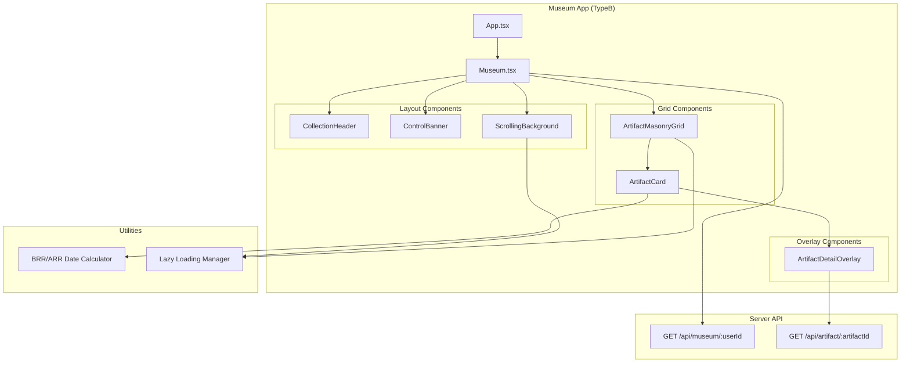

# Design Document

## Overview

The Museum UI Redesign transforms the museum experience from a simple grid view into an immersive, collection-style interface. This design introduces a compact masonry layout with a horizontally scrolling background of artifact thumbnails, sticky navigation controls, and enhanced discovery tracking. The redesign builds on the existing artifact persistence system (centralized artifact database + player references) and focuses purely on the presentation layer and user experience enhancements.

## Architecture

### High-Level Component Structure



### Data Flow

1. **Museum loads** → Fetch player's artifact collection from API
2. **User changes sort** → Re-fetch with new sort parameter
3. **User clicks artifact** → Open overlay with full details
4. **User toggles auto-scroll** → Enable/disable background animation
5. **User scrolls grid** → Lazy load more artifacts

## Components and Interfaces

### 1. Collection Header (Sticky)

**Purpose:** Display personalized collection banner that stays visible while scrolling

**Location:** `src/client/typeB/components/CollectionHeader.tsx`

**Props:**

```typescript
interface CollectionHeaderProps {
  username: string;
}
```

**Implementation:**

```typescript
export const CollectionHeader: React.FC<CollectionHeaderProps> = ({ username }) => {
  return (
    <div className="sticky top-0 z-50 bg-gradient-to-r from-amber-50 to-orange-50 border-b-4 border-amber-600 shadow-lg">
      <div className="max-w-7xl mx-auto px-4 py-6">
        <h1 className="text-4xl font-bold text-center text-amber-900">
          The u/{username} Collection
        </h1>
        <p className="text-center text-amber-700 mt-2">
          A curated gallery of excavated artifacts
        </p>
      </div>
    </div>
  );
};
```

### 2. Control Banner (Sticky)

**Purpose:** Provide sorting controls, statistics, and auto-scroll toggle

**Location:** `src/client/typeB/components/ControlBanner.tsx`

**Props:**

```typescript
interface ControlBannerProps {
  stats: {
    totalFound: number;
    uniqueSubreddits: number;
    firstDiscoveries: number;
    totalBroken: number;
  };
  sortBy: 'date' | 'rarity' | 'subreddit';
  onSortChange: (sort: 'date' | 'rarity' | 'subreddit') => void;
  autoScroll: boolean;
  onAutoScrollToggle: () => void;
}
```

**Implementation:**

```typescript
export const ControlBanner: React.FC<ControlBannerProps> = ({
  stats,
  sortBy,
  onSortChange,
  autoScroll,
  onAutoScrollToggle,
}) => {
  return (
    <div className="sticky top-[120px] z-40 bg-white/95 backdrop-blur-sm shadow-md border-b border-gray-200">
      <div className="max-w-7xl mx-auto px-4 py-3">
        {/* Stats Row */}
        <div className="flex justify-center gap-6 mb-3">
          <StatBadge icon="✅" value={stats.totalFound} label="Found" />
          <StatBadge icon="🗺️" value={stats.uniqueSubreddits} label="Subreddits" />
          <StatBadge icon="⭐" value={stats.firstDiscoveries} label="First Discoveries" />
          <StatBadge icon="💔" value={stats.totalBroken} label="Broken" />
        </div>

        {/* Controls Row */}
        <div className="flex justify-center gap-2">
          <SortButton
            active={sortBy === 'date'}
            onClick={() => onSortChange('date')}
            icon="📅"
            label="Date"
          />
          <SortButton
            active={sortBy === 'rarity'}
            onClick={() => onSortChange('rarity')}
            icon="💎"
            label="Rarity"
          />
          <SortButton
            active={sortBy === 'subreddit'}
            onClick={() => onSortChange('subreddit')}
            icon="📂"
            label="Subreddit"
          />
          <div className="border-l border-gray-300 mx-2" />
          <ToggleButton
            active={autoScroll}
            onClick={onAutoScrollToggle}
            icon="🔄"
            label="Auto-scroll"
          />
        </div>
      </div>
    </div>
  );
};
```

### 3. Scrolling Background Grid

**Purpose:** Display horizontally scrolling background of artifact thumbnails

**Location:** `src/client/typeB/components/ScrollingBackground.tsx`

**Props:**

```typescript
interface ScrollingBackgroundProps {
  artifacts: ArtifactWithPlayerData[];
  autoScroll: boolean;
}
```

**Implementation:**

```typescript
export const ScrollingBackground: React.FC<ScrollingBackgroundProps> = ({
  artifacts,
  autoScroll,
}) => {
  const scrollRef = useRef<HTMLDivElement>(null);
  const [scrollPosition, setScrollPosition] = useState(0);

  useEffect(() => {
    if (!autoScroll || !scrollRef.current) return;

    const interval = setInterval(() => {
      setScrollPosition((prev) => {
        const maxScroll = scrollRef.current!.scrollWidth - scrollRef.current!.clientWidth;
        const newPos = prev + 1;
        return newPos >= maxScroll ? 0 : newPos;
      });
    }, 50); // Slow scroll speed

    return () => clearInterval(interval);
  }, [autoScroll]);

  useEffect(() => {
    if (scrollRef.current) {
      scrollRef.current.scrollLeft = scrollPosition;
    }
  }, [scrollPosition]);

  return (
    <div className="fixed inset-0 z-0 overflow-hidden pointer-events-none">
      <div className="absolute inset-0 bg-gradient-to-b from-purple-50/50 to-blue-50/50" />
      <div
        ref={scrollRef}
        className="flex gap-2 p-4 overflow-x-hidden"
        style={{ scrollBehavior: 'smooth' }}
      >
        {/* Duplicate artifacts for seamless loop */}
        {[...artifacts, ...artifacts].map((artifact, index) => (
          <BackgroundThumbnail key={`${artifact.artifactId}-${index}`} artifact={artifact} />
        ))}
      </div>
    </div>
  );
};

const BackgroundThumbnail: React.FC<{ artifact: ArtifactWithPlayerData }> = ({ artifact }) => {
  if (artifact.type === 'post' && artifact.redditPost?.thumbnailUrl) {
    return (
      
    );
  }
  return null;
};
```

### 4. Artifact Masonry Grid

**Purpose:** Display artifacts in a compact masonry layout with lazy loading

**Location:** `src/client/typeB/components/ArtifactMasonryGrid.tsx`

**Props:**

```typescript
interface ArtifactMasonryGridProps {
  artifacts: ArtifactWithPlayerData[];
  onArtifactClick: (artifact: ArtifactWithPlayerData) => void;
  currentUserId: string;
}
```

**Implementation:**

```typescript
export const ArtifactMasonryGrid: React.FC<ArtifactMasonryGridProps> = ({
  artifacts,
  onArtifactClick,
  currentUserId,
}) => {
  const [visibleCount, setVisibleCount] = useState(20);
  const observerRef = useRef<IntersectionObserver | null>(null);
  const loadMoreRef = useRef<HTMLDivElement>(null);

  useEffect(() => {
    observerRef.current = new IntersectionObserver(
      (entries) => {
        if (entries[0].isIntersecting && visibleCount < artifacts.length) {
          setVisibleCount((prev) => Math.min(prev + 20, artifacts.length));
        }
      },
      { threshold: 0.1 }
    );

    if (loadMoreRef.current) {
      observerRef.current.observe(loadMoreRef.current);
    }

    return () => observerRef.current?.disconnect();
  }, [visibleCount, artifacts.length]);

  const visibleArtifacts = artifacts.slice(0, visibleCount);

  return (
    <div className="relative z-10 max-w-7xl mx-auto px-4 py-6">
      <div className="grid grid-cols-2 md:grid-cols-4 lg:grid-cols-6 gap-3 auto-rows-[200px]">
        {visibleArtifacts.map((artifact) => (
          <ArtifactCard
            key={artifact.artifactId}
            artifact={artifact}
            onClick={() => onArtifactClick(artifact)}
            isFirstDiscovery={artifact.firstDiscoveredBy === currentUserId}
          />
        ))}
      </div>
      <div ref={loadMoreRef} className="h-10" />
    </div>
  );
};
```

### 5. Artifact Card (Reddit-style)

**Purpose:** Display individual artifact in compact Reddit-style format with badges

**Location:** `src/client/typeB/components/ArtifactCard.tsx`

**Props:**

```typescript
interface ArtifactCardProps {
  artifact: ArtifactWithPlayerData;
  onClick: () => void;
  isFirstDiscovery: boolean;
}
```

**Implementation:**

```typescript
export const ArtifactCard: React.FC<ArtifactCardProps> = ({
  artifact,
  onClick,
  isFirstDiscovery,
}) => {
  const hasImage = artifact.type === 'post' && artifact.redditPost?.thumbnailUrl;
  const gridSpan = hasImage ? 'col-span-2 row-span-2' : 'col-span-1 row-span-2';
  const rarityTier = getRarityTier(artifact.foundByCount);
  const brrDate = calculateBRRDate(artifact.redditPost?.createdAt || artifact.firstDiscoveredAt);

  return (
    <div
      className={`${gridSpan} bg-white rounded-lg shadow-md hover:shadow-xl transition-shadow cursor-pointer overflow-hidden relative group`}
      onClick={onClick}
    >
      {/* Badges */}
      <div className="absolute top-2 right-2 z-10 flex flex-col gap-1">
        <RarityBadge tier={rarityTier} />
        <SubredditBadge subreddit={artifact.subredditOfOrigin} />
        {isFirstDiscovery && <FirstDiscoveryBadge />}
      </div>

      {/* Content */}
      {hasImage ? (
        <ImagePostCard artifact={artifact} brrDate={brrDate} />
      ) : (
        <TextPostCard artifact={artifact} brrDate={brrDate} />
      )}
    </div>
  );
};

const ImagePostCard: React.FC<{ artifact: ArtifactWithPlayerData; brrDate: string }> = ({
  artifact,
  brrDate,
}) => {
  return (
    <>
      
      <div className="p-3 h-1/3 flex flex-col justify-between">
        <h3 className="text-sm font-semibold line-clamp-2">{artifact.redditPost!.title}</h3>
        <PostMetadata
          score={artifact.redditPost!.score}
          numComments={0}
          date={brrDate}
        />
      </div>
    </>
  );
};

const TextPostCard: React.FC<{ artifact: ArtifactWithPlayerData; brrDate: string }> = ({
  artifact,
  brrDate,
}) => {
  return (
    <div className="p-3 h-full flex flex-col justify-between">
      <h3 className="text-xs font-semibold line-clamp-4">{artifact.redditPost!.title}</h3>
      <PostMetadata
        score={artifact.redditPost!.score}
        numComments={0}
        date={brrDate}
      />
    </div>
  );
};

const PostMetadata: React.FC<{ score: number; numComments: number; date: string }> = ({
  score,
  numComments,
  date,
}) => {
  return (
    <div className="flex items-center gap-2 text-xs text-gray-500">
      <span>⬆️ {formatNumber(score)}</span>
      <span>💬 {formatNumber(numComments)}</span>
      <span>{date}</span>
    </div>
  );
};
```

### 6. Badge Components

**Purpose:** Display pinned badges for rarity, subreddit, and first discovery

**Location:** `src/client/typeB/components/Badges.tsx`

**Implementation:**

```typescript
export const RarityBadge: React.FC<{ tier: RarityTier }> = ({ tier }) => {
  const config = {
    unique: { icon: '⭐', color: 'bg-gradient-to-r from-yellow-400 to-orange-500' },
    ultra_rare: { icon: '💎', color: 'bg-gradient-to-r from-purple-400 to-pink-500' },
    rare: { icon: '🔷', color: 'bg-gradient-to-r from-blue-400 to-cyan-500' },
    uncommon: { icon: '🔹', color: 'bg-gradient-to-r from-green-400 to-emerald-500' },
    common: { icon: '⚪', color: 'bg-gradient-to-r from-gray-300 to-gray-400' },
  };

  const { icon, color } = config[tier];

  return (
    <div className={`${color} text-white text-xs px-2 py-1 rounded-full shadow-lg`}>
      {icon}
    </div>
  );
};

export const SubredditBadge: React.FC<{ subreddit: string }> = ({ subreddit }) => {
  return (
    <div className="bg-blue-500 text-white text-xs px-2 py-1 rounded-full shadow-lg">
      r/{subreddit}
    </div>
  );
};

export const FirstDiscoveryBadge: React.FC = () => {
  return (
    <div className="bg-gradient-to-r from-amber-400 to-yellow-500 text-white text-xs px-2 py-1 rounded-full shadow-lg animate-pulse">
      🏆 First!
    </div>
  );
};
```

### 7. Artifact Detail Overlay

**Purpose:** Display full artifact details in a modal overlay

**Location:** `src/client/typeB/components/ArtifactDetailOverlay.tsx`

**Props:**

```typescript
interface ArtifactDetailOverlayProps {
  artifact: ArtifactWithPlayerData;
  isFirstDiscovery: boolean;
  onClose: () => void;
}
```

**Implementation:**

```typescript
export const ArtifactDetailOverlay: React.FC<ArtifactDetailOverlayProps> = ({
  artifact,
  isFirstDiscovery,
  onClose,
}) => {
  const rarityTier = getRarityTier(artifact.foundByCount);
  const brrDate = calculateBRRDate(artifact.redditPost?.createdAt || artifact.firstDiscoveredAt);
  const actualAge = calculateActualAge(artifact.redditPost?.createdAt || artifact.firstDiscoveredAt);

  return (
    <div
      className="fixed inset-0 z-50 flex items-center justify-center bg-black/50 backdrop-blur-sm"
      onClick={onClose}
    >
      <div
        className="bg-white rounded-lg shadow-2xl max-w-2xl w-full mx-4 max-h-[90vh] overflow-y-auto"
        onClick={(e) => e.stopPropagation()}
      >
        {/* Header */}
        <div className="sticky top-0 bg-white border-b border-gray-200 p-4 flex justify-between items-center">
          <h2 className="text-xl font-bold">Artifact Details</h2>
          <button
            onClick={onClose}
            className="text-gray-500 hover:text-gray-700 text-2xl"
          >
            ×
          </button>
        </div>

        {/* Content */}
        <div className="p-6">
          {/* First Discovery Banner */}
          {isFirstDiscovery && (
            <div className="bg-gradient-to-r from-amber-100 to-yellow-100 border-2 border-amber-400 rounded-lg p-4 mb-4">
              <p className="text-center text-amber-900 font-bold text-lg">
                🏆 You discovered this first!
              </p>
            </div>
          )}

          {/* Image */}
          {artifact.type === 'post' && artifact.redditPost?.thumbnailUrl && (
            
          )}

          {/* Title */}
          <h3 className="text-2xl font-bold mb-4">{artifact.redditPost?.title}</h3>

          {/* Metadata Grid */}
          <div className="grid grid-cols-2 gap-4 mb-6">
            <MetadataItem label="Subreddit" value={`r/${artifact.subredditOfOrigin}`} />
            <MetadataItem label="Posted" value={`${brrDate} (${actualAge})`} />
            <MetadataItem label="Score" value={`⬆️ ${formatNumber(artifact.redditPost?.score || 0)}`} />
            <MetadataItem label="Rarity" value={getRarityLabel(rarityTier)} />
            <MetadataItem label="Found By" value={`${artifact.foundByCount} players`} />
            <MetadataItem label="First Discovered By" value={`u/${artifact.firstDiscoveredBy || 'Unknown'}`} />
          </div>

          {/* Collected Info */}
          <div className="bg-gray-50 rounded-lg p-4">
            <p className="text-sm text-gray-600">
              You collected this on {new Date(artifact.collectedAt).toLocaleDateString()}
            </p>
            <p className="text-sm text-gray-600">
              From dig site: {artifact.sourceDigSite}
            </p>
          </div>

          {/* View on Reddit */}
          {artifact.redditPost?.permalink && (
            <a
              href={`https://reddit.com${artifact.redditPost.permalink}`}
              target="_blank"
              rel="noopener noreferrer"
              className="block mt-4 text-center bg-orange-500 text-white py-2 rounded-lg hover:bg-orange-600"
            >
              View on Reddit →
            </a>
          )}
        </div>
      </div>
    </div>
  );
};

const MetadataItem: React.FC<{ label: string; value: string }> = ({ label, value }) => {
  return (
    <div>
      <p className="text-xs text-gray-500 uppercase">{label}</p>
      <p className="text-sm font-semibold">{value}</p>
    </div>
  );
};
```

### 8. BRR/ARR Date Calculator

**Purpose:** Calculate dates relative to Reddit Redesign (April 1, 2018)

**Location:** `src/client/typeB/utils/dateCalculator.ts`

**Implementation:**

```typescript
const REDDIT_REDESIGN_DATE = new Date('2018-04-01').getTime();

/**
 * Calculate BRR/ARR date format
 * @param timestamp - Unix timestamp in milliseconds
 * @returns Formatted string like "2¼ BRR" or "1 ARR"
 */
export function calculateBRRDate(timestamp: number): string {
  const diffMs = Math.abs(timestamp - REDDIT_REDESIGN_DATE);
  const diffYears = diffMs / (1000 * 60 * 60 * 24 * 365.25);

  const wholeYears = Math.floor(diffYears);
  const fraction = diffYears - wholeYears;

  let fractionSymbol = '';
  if (fraction >= 0.75) {
    fractionSymbol = '¾';
  } else if (fraction >= 0.5) {
    fractionSymbol = '½';
  } else if (fraction >= 0.25) {
    fractionSymbol = '¼';
  }

  const yearString = wholeYears === 0 ? fractionSymbol : `${wholeYears}${fractionSymbol}`;
  const era = timestamp < REDDIT_REDESIGN_DATE ? 'BRR' : 'ARR';

  return `${yearString} ${era}`.trim();
}

/**
 * Calculate actual age in years and months
 * @param timestamp - Unix timestamp in milliseconds
 * @returns Formatted string like "5 years, 3 months old"
 */
export function calculateActualAge(timestamp: number): string {
  const now = Date.now();
  const diffMs = now - timestamp;

  const years = Math.floor(diffMs / (1000 * 60 * 60 * 24 * 365.25));
  const months = Math.floor(
    (diffMs % (1000 * 60 * 60 * 24 * 365.25)) / (1000 * 60 * 60 * 24 * 30.44)
  );

  if (years === 0) {
    return `${months} month${months !== 1 ? 's' : ''} old`;
  }

  return `${years} year${years !== 1 ? 's' : ''}, ${months} month${months !== 1 ? 's' : ''} old`;
}

/**
 * Format large numbers with K/M suffixes
 */
export function formatNumber(num: number): string {
  if (num >= 1000000) {
    return `${(num / 1000000).toFixed(1)}M`;
  }
  if (num >= 1000) {
    return `${(num / 1000).toFixed(1)}K`;
  }
  return num.toString();
}
```

### 9. Main Museum Component

**Purpose:** Orchestrate all museum components and manage state

**Location:** `src/client/typeB/components/Museum.tsx`

**Implementation:**

```typescript
export const Museum: React.FC<{ userId: string }> = ({ userId }) => {
  const [museumData, setMuseumData] = useState<GetMuseumResponse | null>(null);
  const [sortBy, setSortBy] = useState<'date' | 'rarity' | 'subreddit'>('date');
  const [autoScroll, setAutoScroll] = useState(false);
  const [selectedArtifact, setSelectedArtifact] = useState<ArtifactWithPlayerData | null>(null);
  const [loading, setLoading] = useState(true);

  useEffect(() => {
    fetchMuseumData();
  }, [userId, sortBy]);

  async function fetchMuseumData() {
    try {
      setLoading(true);
      const data = await fetchAPI<GetMuseumResponse>(
        `/api/museum/${userId}?sortBy=${sortBy}&includeBroken=false`
      );
      setMuseumData(data);
    } catch (error) {
      console.error('Failed to fetch museum:', error);
    } finally {
      setLoading(false);
    }
  }

  if (loading) return <LoadingSpinner />;
  if (!museumData) return <ErrorMessage />;

  // Calculate first discoveries
  const firstDiscoveries = museumData.artifacts.filter(
    (a) => a.firstDiscoveredBy === userId
  ).length;

  const stats = {
    ...museumData.stats,
    firstDiscoveries,
  };

  return (
    <div className="min-h-screen relative">
      {/* Scrolling Background */}
      <ScrollingBackground artifacts={museumData.artifacts} autoScroll={autoScroll} />

      {/* Header */}
      <CollectionHeader username={userId} />

      {/* Control Banner */}
      <ControlBanner
        stats={stats}
        sortBy={sortBy}
        onSortChange={setSortBy}
        autoScroll={autoScroll}
        onAutoScrollToggle={() => setAutoScroll(!autoScroll)}
      />

      {/* Artifact Grid */}
      <ArtifactMasonryGrid
        artifacts={museumData.artifacts}
        onArtifactClick={setSelectedArtifact}
        currentUserId={userId}
      />

      {/* Detail Overlay */}
      {selectedArtifact && (
        <ArtifactDetailOverlay
          artifact={selectedArtifact}
          isFirstDiscovery={selectedArtifact.firstDiscoveredBy === userId}
          onClose={() => setSelectedArtifact(null)}
        />
      )}
    </div>
  );
};
```

## Data Models

### Extended Artifact Types

**Location:** `src/shared/types/artifact.ts`

```typescript
// Add firstDiscoveredBy to CentralizedArtifact
export interface CentralizedArtifact {
  artifactId: string;
  type: 'post' | 'subreddit_relic';
  subredditOfOrigin: string;
  foundByCount: number;
  firstDiscoveredAt: number;
  firstDiscoveredBy: string; // NEW: Username of first discoverer
  redditPost?: RedditPost;
  subredditRelic?: SubredditRelic;
}

// ArtifactWithPlayerData inherits firstDiscoveredBy
export interface ArtifactWithPlayerData extends CentralizedArtifact {
  collectedAt: number;
  isBroken: boolean;
  sourceDigSite: string;
}
```

### Museum Stats

```typescript
export interface MuseumStats {
  totalFound: number;
  totalBroken: number;
  uniqueSubreddits: number;
  firstDiscoveries: number; // NEW: Count of artifacts user discovered first
}
```

## API Changes

### Update Artifact Creation

**Location:** `src/server/core/artifact-discovery.ts`

**Change:** Add `firstDiscoveredBy` when creating new artifacts

```typescript
async function createCentralizedArtifact(
  artifactId: string,
  artifactData: ArtifactData,
  userId: string // NEW: Add userId parameter
): Promise<CentralizedArtifact> {
  const artifact: CentralizedArtifact = {
    artifactId,
    type: artifactData.type,
    subredditOfOrigin:
      artifactData.type === 'post'
        ? artifactData.redditData.subreddit
        : artifactData.relicData.subredditName,
    foundByCount: 0,
    firstDiscoveredAt: Date.now(),
    firstDiscoveredBy: userId, // NEW: Record first discoverer
  };

  if (artifactData.type === 'post') {
    artifact.redditPost = artifactData.redditData;
  } else {
    artifact.subredditRelic = artifactData.relicData;
  }

  await redis.set(`artifact:${artifactId}`, JSON.stringify(artifact));
  return artifact;
}
```

### Update Museum API Response

**Location:** `src/server/core/museum-data.ts`

**Change:** Calculate first discoveries in stats

```typescript
async function getPlayerMuseum(userId: string): Promise<MuseumData> {
  const collection = await getPlayerCollection(userId);

  const artifactsWithDetails = await Promise.all(
    collection.artifacts.map(async (ref) => {
      const artifact = await getArtifactById(ref.artifactId);
      return {
        ...artifact,
        collectedAt: ref.collectedAt,
        isBroken: ref.isBroken,
        sourceDigSite: ref.sourceDigSite,
      };
    })
  );

  // Filter out broken artifacts (they shouldn't be in collection)
  const validArtifacts = artifactsWithDetails.filter((a) => !a.isBroken);

  // Calculate stats including first discoveries
  const firstDiscoveries = validArtifacts.filter((a) => a.firstDiscoveredBy === userId).length;

  const stats = {
    totalFound: validArtifacts.length,
    totalBroken: collection.brokenCount || 0, // Store broken count separately
    uniqueSubreddits: new Set(validArtifacts.map((a) => a.subredditOfOrigin)).size,
    firstDiscoveries, // NEW
  };

  return {
    userId,
    artifacts: validArtifacts,
    stats,
  };
}
```

### Update Broken Artifact Handling

**Location:** `src/server/core/artifact-discovery.ts`

**Change:** Don't add broken artifacts to collection, just increment counter

```typescript
async function saveDiscoveredArtifact(
  userId: string,
  artifactData: ArtifactData,
  sourceDigSite: string,
  isBroken: boolean
): Promise<SaveArtifactResponse> {
  const artifactId = generateArtifactId(artifactData);

  // Check if artifact exists
  let artifact = await getArtifactById(artifactId);

  // If not exists, create new artifact record
  if (!artifact) {
    artifact = await createCentralizedArtifact(artifactId, artifactData, userId);
  }

  if (isBroken) {
    // Don't add to collection, just increment broken counter
    await incrementBrokenCounter(userId);
    await updateDigSiteStats(sourceDigSite, 'broken');
  } else {
    // Add to collection
    await incrementFoundByCount(artifactId);
    const reference: PlayerArtifactReference = {
      artifactId,
      userId,
      collectedAt: Date.now(),
      isBroken: false,
      sourceDigSite,
    };
    await addPlayerReference(userId, reference);
    await updateDigSiteStats(sourceDigSite, 'found');
  }

  return {
    success: true,
    artifactId,
    foundByCount: artifact.foundByCount,
  };
}

async function incrementBrokenCounter(userId: string): Promise<void> {
  const key = `player:${userId}:broken_count`;
  const current = await redis.get(key);
  const count = current ? parseInt(current) : 0;
  await redis.set(key, (count + 1).toString());
}

async function getBrokenCount(userId: string): Promise<number> {
  const key = `player:${userId}:broken_count`;
  const count = await redis.get(key);
  return count ? parseInt(count) : 0;
}
```

## Error Handling

### Missing First Discoverer

**Problem:** Old artifacts may not have `firstDiscoveredBy` field

**Solution:** Handle gracefully with fallback

```typescript
function getFirstDiscoverer(artifact: CentralizedArtifact): string {
  return artifact.firstDiscoveredBy || 'Unknown';
}
```

### Image Loading Failures

**Problem:** Thumbnail URLs may be broken or expired

**Solution:** Use fallback placeholder

```typescript
const ImageWithFallback: React.FC<{ src: string; alt: string }> = ({ src, alt }) => {
  const [error, setError] = useState(false);

  if (error) {
    return (
      <div className="w-full h-full bg-gray-200 flex items-center justify-center">
        <span className="text-4xl">🏺</span>
      </div>
    );
  }

  return (
     setError(true)}
      loading="lazy"
    />
  );
};
```

### Lazy Loading Performance

**Problem:** Loading too many artifacts at once can cause lag

**Solution:** Implement intersection observer with throttling

```typescript
const useLazyLoad = (initialCount: number, increment: number, total: number) => {
  const [visibleCount, setVisibleCount] = useState(initialCount);
  const [isLoading, setIsLoading] = useState(false);

  const loadMore = useCallback(() => {
    if (isLoading || visibleCount >= total) return;

    setIsLoading(true);
    setTimeout(() => {
      setVisibleCount((prev) => Math.min(prev + increment, total));
      setIsLoading(false);
    }, 100);
  }, [isLoading, visibleCount, total, increment]);

  return { visibleCount, loadMore, hasMore: visibleCount < total };
};
```

## Testing Strategy

### Unit Tests

**Date Calculator:**

- Test BRR dates (before April 1, 2018)
- Test ARR dates (after April 1, 2018)
- Test fractional notation (¼, ½, ¾)
- Test edge cases (exactly on April 1, 2018)
- Test actual age calculation

**Rarity Calculation:**

- Test unique (foundByCount = 1)
- Test ultra rare (foundByCount < 5)
- Test rare (5-20)
- Test uncommon (21-100)
- Test common (>100)

**Number Formatting:**

- Test K suffix (1000+)
- Test M suffix (1000000+)
- Test small numbers

### Component Tests

**ArtifactCard:**

- Test image post rendering (2x2 grid)
- Test text post rendering (1x2 grid)
- Test badge display (rarity, subreddit, first discovery)
- Test click handler

**ScrollingBackground:**

- Test auto-scroll enabled
- Test auto-scroll disabled
- Test seamless loop
- Test lazy loading

**ControlBanner:**

- Test sort button clicks
- Test auto-scroll toggle
- Test stats display

### Integration Tests

**Museum Flow:**

- Test loading museum data
- Test sorting by date/rarity/subreddit
- Test clicking artifact opens overlay
- Test overlay displays correct data
- Test closing overlay
- Test first discovery badge appears for user's discoveries

### Performance Tests

**Lazy Loading:**

- Test initial load (20 artifacts)
- Test loading more on scroll
- Test with 100+ artifacts
- Measure render time

**Auto-Scroll:**

- Test smooth scrolling
- Test performance with 50+ thumbnails
- Test memory usage over time

## Technical Decisions and Rationales

### Masonry Grid Layout

**Decision:** Use CSS Grid with variable row/column spans

**Rationale:**

- Flexible layout that adapts to content
- Image posts (2x2) stand out visually
- Text posts (1x2) are compact but readable
- Native CSS Grid is performant
- Responsive without complex calculations

### Sticky Positioning

**Decision:** Use CSS `position: sticky` for header and controls

**Rationale:**

- Native browser support, no JS required
- Smooth scrolling performance
- Always accessible controls
- Better UX than fixed positioning
- Works well with z-index layering

### Lazy Loading with Intersection Observer

**Decision:** Use Intersection Observer API for lazy loading

**Rationale:**

- Native browser API, highly performant
- Automatically detects when to load more
- Better than scroll event listeners
- Supports image lazy loading
- Reduces initial load time

### BRR/ARR Date Format

**Decision:** Calculate dates relative to April 1, 2018 with fractional notation

**Rationale:**

- Fun, thematic way to show post age
- Creates unique identity for the museum
- Fractional notation (¼, ½, ¾) is readable
- Provides historical context
- Complements actual age in detailed view

### Pinned Badges

**Decision:** Use absolute positioning for badges on cards

**Rationale:**

- Doesn't disrupt card layout
- Always visible regardless of content
- Easy to identify rarity at a glance
- Supports multiple badges (rarity, subreddit, first discovery)
- Visually distinct from post content

### Auto-Scroll Toggle

**Decision:** Make background auto-scroll optional with toggle

**Rationale:**

- Some users may find auto-scroll distracting
- Gives users control over their experience
- Slow scroll speed when enabled
- Can pause to view specific thumbnails
- Reduces motion for accessibility

### Broken Artifacts Counter Only

**Decision:** Don't add broken artifacts to collection, only count them

**Rationale:**

- Broken artifacts are a failure state
- Players shouldn't be rewarded for breaking artifacts
- Keeps museum focused on successes
- Counter provides feedback without clutter
- Encourages careful excavation

### First Discovery Tracking

**Decision:** Record username of first discoverer in artifact record

**Rationale:**

- Creates sense of achievement
- Encourages exploration of less-popular subreddits
- Provides social proof
- Simple string field, minimal storage
- Supports "First Discoveries" stat

### Reddit-Style Post Format

**Decision:** Mimic Reddit's post layout (title, score, comments, date)

**Rationale:**

- Familiar to Reddit users
- Provides context for artifacts
- Shows post popularity (score)
- Compact and information-dense
- Maintains Reddit aesthetic

### Scrolling Background

**Decision:** Display semi-transparent scrolling grid of thumbnails

**Rationale:**

- Showcases entire collection
- Creates dynamic, engaging atmosphere
- Doesn't distract from main content (semi-transparent)
- Lazy loads for performance
- Loops seamlessly for continuous effect

## Implementation Notes

### CSS Grid Configuration

```css
.masonry-grid {
  display: grid;
  grid-template-columns: repeat(auto-fill, minmax(150px, 1fr));
  grid-auto-rows: 200px;
  gap: 12px;
}

.image-post {
  grid-column: span 2;
  grid-row: span 2;
}

.text-post {
  grid-column: span 1;
  grid-row: span 2;
}
```

### Sticky Positioning

```css
.sticky-header {
  position: sticky;
  top: 0;
  z-index: 50;
}

.sticky-controls {
  position: sticky;
  top: 120px; /* Below header */
  z-index: 40;
}
```

### Auto-Scroll Animation

```typescript
// Smooth, continuous scroll
const scrollSpeed = 1; // pixels per frame
const interval = 50; // ms between frames

setInterval(() => {
  scrollPosition += scrollSpeed;
  if (scrollPosition >= maxScroll) {
    scrollPosition = 0; // Loop back
  }
}, interval);
```

### Lazy Loading Threshold

```typescript
// Load more when user is 200px from bottom
const observerOptions = {
  root: null,
  rootMargin: '200px',
  threshold: 0.1,
};
```

### Responsive Breakpoints

```css
/* Mobile: 2 columns */
@media (max-width: 768px) {
  .masonry-grid {
    grid-template-columns: repeat(2, 1fr);
  }
}

/* Tablet: 4 columns */
@media (min-width: 769px) and (max-width: 1024px) {
  .masonry-grid {
    grid-template-columns: repeat(4, 1fr);
  }
}

/* Desktop: 6 columns */
@media (min-width: 1025px) {
  .masonry-grid {
    grid-template-columns: repeat(6, 1fr);
  }
}
```

## Migration Plan

### Phase 1: Data Migration

1. Add `firstDiscoveredBy` field to existing artifacts
2. Set to "Unknown" for old artifacts
3. Update artifact creation to include userId

### Phase 2: Broken Artifacts

1. Create `player:{userId}:broken_count` keys
2. Migrate broken artifacts from collections to counters
3. Remove broken artifacts from player collections

### Phase 3: UI Components

1. Create new components (CollectionHeader, ControlBanner, etc.)
2. Implement BRR/ARR date calculator
3. Build masonry grid layout
4. Add scrolling background

### Phase 4: Testing & Polish

1. Test lazy loading with large collections
2. Test auto-scroll performance
3. Test responsive design on mobile/tablet
4. Polish animations and transitions

## Future Enhancements

### Potential Features

1. **Search/Filter** - Search artifacts by title or filter by subreddit
2. **Collections** - Group artifacts into custom collections
3. **Sharing** - Share individual artifacts or entire collection
4. **Achievements** - Badges for milestones (100 artifacts, 10 first discoveries, etc.)
5. **Leaderboards** - Compare first discoveries with other players
6. **Export** - Download collection as JSON or image gallery
7. **Themes** - Different visual themes for the museum
8. **Artifact Notes** - Add personal notes to artifacts

### Performance Optimizations

1. **Virtual Scrolling** - Render only visible artifacts
2. **Image CDN** - Cache and optimize thumbnail images
3. **Prefetching** - Preload next batch of artifacts
4. **Service Worker** - Offline support and caching
5. **WebP Images** - Use modern image formats for smaller sizes
